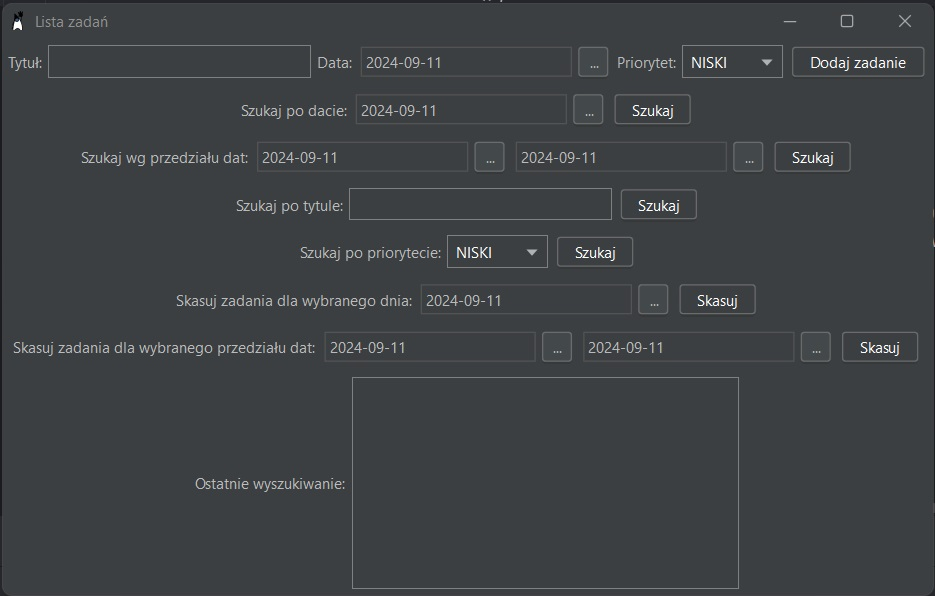

## Uruchomienie projektu

Aby pomyślnie uruchomić projekt, wykonaj następujące kroki:

Pierwszym krokiem jest skompilowanie kodu źródłowego. Aby to zrobić, musisz mieć Javę w wersji 11.

Zaleca się kompilowanie i uruchamianie w środowisku programistycznym IntelliJ. To środowisko jest najlepszym wyborem do tworzenia graficznego interfejsu użytkownika i pozwala na łączenie komponentów interfejsu bez konieczności stosowania dodatkowego kodu.
Opis aplikacji

Aplikacja Lista_zadan to prosta aplikacja do zarządzania zadaniami, która pomaga organizować zadania, ustalać ich priorytety i wyszukiwać według różnych kryteriów. Aplikacja pozwala użytkownikom dodawać, wyszukiwać i usuwać zadania, a także sortować je według priorytetu i daty.

## Do głównych funkcjonalności aplikacji należą:

    • Dodaj zadanie: Użytkownicy mogą dodawać nowe zadania, wprowadzając tytuł zadania, datę i priorytet

    • Szukaj według daty: Aplikacja umożliwia użytkownikom wyszukiwanie zadań według wybraną datę i wyświetla je według priorytetów.

    • Szukaj według zakresu dat: Użytkownicy mogą zdefiniować datę początkową i końcową

    • Wyszukiwanie zadań w wybranym przedziale czasu

    • Szukaj po tytule: Aplikacja pozwala na wyszukiwanie po tytule zadania, co znacznie ułatwia znalezienie konkretnych zadań

    • Szukaj według priorytetu: Użytkownicy mogą wyszukiwać zadania według priorytetu, który 	pomaga zidentyfikować najważniejsze i najmniej pilne zadania.

    • Usuń według daty: Aplikacja umożliwia użytkownikom usuwanie zadań na podstawie daty. Po wykonaniu akcji zadania na wybraną datę nie będą już znajdować się w kalendarzu użytkownika.

    • Usuń według przedziału dat: Aplikacja umożliwia użytkownikom usuwanie zadań na podstawie przedziału czasowego. Po wykonaniu akcji zadania znajdujące się w        wybranym przedziale nie będą już znajdować się w kalendarzu użytkownika.

## Opis wdrożenia aplikacji

### Wstęp

Aplikacja Lista_zadan to narzędzie do zarządzania zadaniami, które pozwala użytkownikom efektywnie dodawać, wyszukiwać i usuwać zadania. Został opracowany z wykorzystaniem języka programowania Java i biblioteki Swing dla graficznego interfejsu użytkownika, a także koncepcji Programowania Aspektowego w celu efektywnego zarządzania funkcjonalnościami takimi jak sprawdzanie daty

### Aspekty aplikacji

#### 1. ExceptionAspect

ExceptionAspect umożliwia monitorowanie i rejestrowanie wyjątków występujących w aplikacji. Ten aspekt jest wykonywany po zgłoszeniu wyjątku w dowolnej metodzie aplikacji. Rejestruje informacje o wyjątku, w tym komunikat o błędzie i metodę zgłoszenia wyjątku.

#### 2. DateValidationAspect

DateValidationAspect służy do sprawdzania dat używanych w zadaniach. Na przykład ten aspekt zapobiega dodawaniu zadań z datami w przeszłości. Sprawdza również zakres dat podczas

#### 3. DateTaskLimitAspect

AspektDateTaskLimitAspect ustala limit maksymalnej liczby zadań, które można dodać w danym dniu. Na przykład, jeśli ustawiona jest maksymalna liczba zadań na dzień wynosząca 15, aspekt ten zapobiegnie dodawaniu nowych zadań po osiągnięciu tego limitu.

## Architektura aplikacji

Aplikacja podzielona jest na następujące komponenty:

#### Klasa Task: 
reprezentuje model zadania z danymi, takimi jak tytuł, data i priorytet. Zawiera także metody porównywania i mieszania zadań.

#### Klasa TaskManager: 
Ta klasa jest odpowiedzialna za zarządzanie zadaniami. Zawiera metody dodawania, wyszukiwania i usuwania zadań. Zapewnia również takie funkcje, jak wyszukiwanie według daty, tytułu i priorytetu.

#### Klasa ToDoAppGUI: 
Ten komponent reprezentuje graficzny interfejs użytkownika aplikacji. Umożliwia użytkownikom interaktywne zarządzanie zadaniami. Interfejs graficzny tworzony jest przy użyciu biblioteki Swing.

#### Klasa DateLabelFormatter: 
ta klasa służy do formatowania i wyświetlania dat w graficznym interfejsie użytkownika przy użyciu metody JDatePickerImpl.

#### Klasa Priority: 
Ta klasa definiuje listę priorytetów, które można wykorzystać w systemie zarządzania zadaniami

## Wykorzystane zasoby

Narzędzia:

    • IntelliJ: Śdowisko programistyczne użyte do opracowania i uruchomienia projektu.

Biblioteki:

    • DarkLaf: Służy do kształtowania graficznego interfejsu użytkownika w celu poprawy jego doświadczenia. 
      
    • JDatePicker: Ta biblioteka służy do pracy z datami. 
      
    • AspectJ: To narzędzie i biblioteka zostały użyte do zaimplementowania aspektów w kodzie aplikacji.